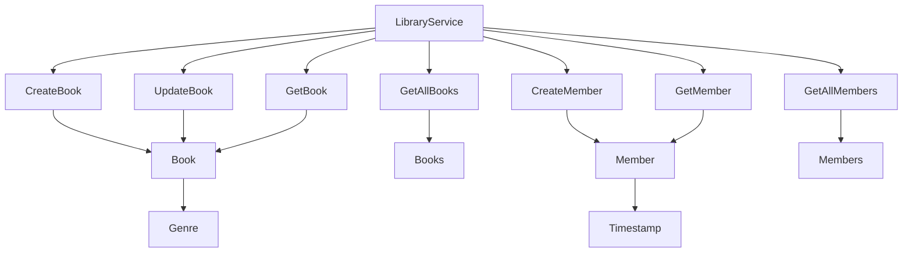

# Library Management System
[](https://index.scala-lang.org/typelevel/cats-effect/cats-effect)
[](https://www.jetify.com/devbox/docs/contributor-quickstart/)

Welcome to the Library Management System, a Scala 3 project demonstrating state-of-the-art techniques in functional programming using `smithy4s` and `cats`. This project showcases how to efficiently manage a library's collections and memberships through a robust and scalable application architecture. All dependencies are seamlessly managed by `Devbox`, ensuring a frictionless setup and execution environment.

## Project Overview

This project serves as an exemplary framework for managing books and library members using a domain-driven design. It utilizes smithy4s for service definition and cats for functional programming, creating a robust and maintainable codebase.

Domain Components
BookRepository: Facilitates operations such as adding, updating, and retrieving books. Each book is validated against predefined models to ensure data integrity.
MemberRepository: Manages library members, supporting functionalities like registration, updates, and data retrieval, providing a comprehensive system for member management.



## Getting Started

These instructions will get you a copy of the project up and running on your local machine for development and testing purposes, without the need for setting up any prerequisites manually.

### Prerequisites

None. Devbox handles all the dependencies for you!

### Installation

1. **Clone the repository:**

    ```bash
   git clone https://github.com/yourusername/library-management-system.git
   cd library-management-system
    ```

1. Launch the Devbox environment:

   ```bash
   devbox shell
    ```

1. Compile and run the project within the Devbox shell:

   ```bash
   sbt run
    ```

## Running Code Generation
To generate Scala code from your Smithy models, execute the following command in your terminal:
   ```bash
    sbt smithy4sCodegen
   ```
This command processes the Smithy model definitions and generates corresponding Scala code that integrates with our system.

## Location of Generated Code
After running the code generation, the generated Scala files can be found in:
`/target/scala-3.3.1/src_managed/main/scala/library/`.
This directory is automatically created by `sbt` and is configured to store generated sources, separating them from manually written source files to avoid conflicts and maintain organization.

## Usage

To utilize the library management system project effectively, follow these steps within your Devbox environment:

**Starting the Application**:
   Launch the application by navigating to the project directory in your Devbox shell and running:

   ```bash
   devbox shell
   sbt run 
   ```

## Built With

This project leverages several advanced technologies and libraries to ensure high performance, reliability, and ease of maintenance:

- **[Smithy4s](https://github.com/disneystreaming/smithy4s)**: Used for defining service models and generating Scala code. It helps maintain a clear separation between the API definition and implementation, enhancing modularity and scalability.
   - `smithy4s-core`: Provides core functionalities for model generation.
   - `smithy4s-http4s`: Integrates Smithy models with the Http4s library, facilitating the creation of HTTP services.
   - `smithy4s-http4s-swagger`: Generates Swagger (OpenAPI) documentation automatically from Smithy models, making API documentation straightforward and always up-to-date.

- **[Http4s](https://http4s.org/)**: A minimal, idiomatic Scala interface for HTTP services, used to build both server and client components:
   - `http4s-ember-server`: A backend HTTP server powered by the Ember engine, known for its simplicity and performance.
   - `http4s-ember-client`: A matching HTTP client for making outbound HTTP requests, ensuring consistency across HTTP interactions.

- **[Cats Effect](https://typelevel.org/cats-effect/)**: Provides powerful abstractions for managing side effects and enabling compositional asynchronous and concurrent programming.
   - `cats-effect`: The main library, offering primitives for asynchronous programming.
   - `cats-effect-std`: Additional standard library utilities that complement the main Cats Effect library, aiding in resource management and other effects operations.

### Testing Frameworks

For ensuring quality and reliability, the following testing frameworks are utilized:
- **[Weaver Test](https://disneystreaming.github.io/weaver-test/)**: A test framework optimized for Cats Effect and Scalacheck integration, providing clear and concise testing capabilities.
   - `weaver-cats`: Enables writing tests in a purely functional style using Cats Effect.
   - `weaver-scalacheck`: Integrates property-based testing capabilities from Scalacheck into Weaver tests.

### Project Management and Build Tools

- **[sbt](https://www.scala-sbt.org/)** (Scala Build Tool): Used for project build management, dependency resolution, and executing tasks such as compilation and testing.

